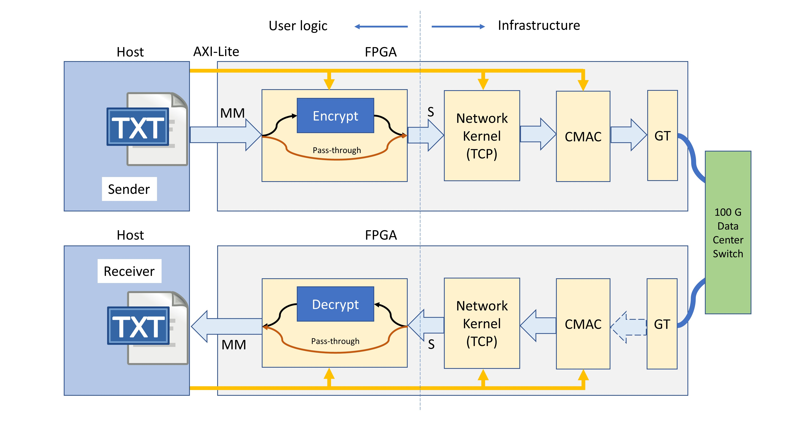
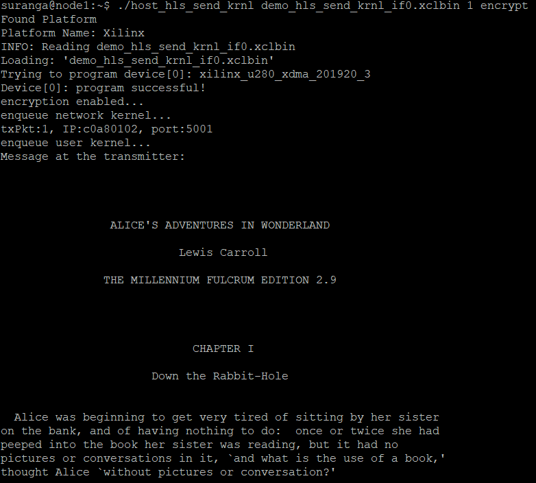
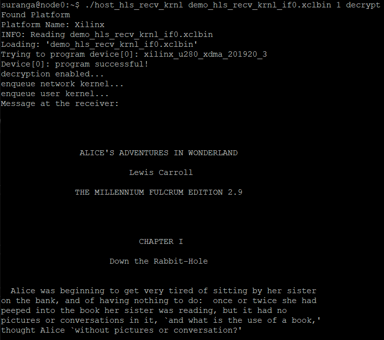

# TCP Encryption and Decryption Example Using 2 Network Attached Alveo U280s

TCPP encrypt and decrypt example with pre-built network layer and cmac kernels. The network layer was built using the TCP/IP stack in [1]. This stack was written in Vivado HLS and was compatible with older versions of Vitis (2020.1 and earlier). Starting 2020.2, Vitis doesn't support Vivado HLS. Therefore, the TCP stack in this example was built using Vitis 2020.1. Nevertheless, you should not be having any issues building this example using Vitis 2021.1 or later versions.

## Introduction

In this example, we use ETH Zurich TCP stack [1] and CMAC kernels as pre-built binary object files (.xo files), and link custom user logic to demonstrate sending and receiving TCP packets between two U280 FPGA accelerator cards. The sender and receiver side user logic kernels have encryption and decryption kernels, respectively, implemented using AES-128 block cipher. The AES code used in this example was taken from [2]. OpenCL host applications have also been provided for both sender and receiver. The host code is also based on [1] with slight modifications. The sender side host executable is used to read a specific number of packets from a text file. The user can use an AXI-Lite control signal connected to the user logic to either encrypt or directly pass these packets over the network layer and cmac to the receiving host. On the receiver side, the user can read the incoming TCP packets as raw data, or decrypt them.   

## Pre-requisites

- An MOC instance should be created by following [this tutorial](https://github.com/OCT-FPGA/oct-tutorials/blob/master/mocsetup/instancesetup.md). You should select the boot image ```vitis-2021.1-ubuntu``` when creating the instance.  It is recommended to use VNC server to run through this example. A simple SSH client without VNC access will also work, however if the session gets disconnected unexpectedly in the middle of the bitsteream build, you will have to start over. Instructions on how to get GUI access using VNC and SSH can be found [here](https://github.com/OCT-FPGA/oct-tutorials/blob/master/vncsshsetup/README.md).

- A Cloudlab experiment should be created with two nodes. Instructions are given [here](https://github.com/OCT-FPGA/oct-tutorials/tree/master/cloudlab-setup). Note that you don't need to set up the experiment until you finish bitstream generation. The Cloudlab experiment is only needed for the targeting workflow. This workflow has been tested and verified using Xilinx RunTime (XRT) version 2021.1. Other versions may also support, but not tested. So, you may select the Cloudlab profile ```fpga-post-boot``` with any of these tool versions, and two compute nodes when creating the experiment.  

## Architecture



The FPGA bitstream consists of (i) user logic, (ii) TCP stack, and (iii) cmac kernels. The user logic consists of sender or receiver logic which can either encrypt/decrypt or pass-through the incoming data using an AXI-Lite control signal. Network layer (TCP) and cmac are provided as binary files. Therefore, the user will only need to build the user logic, link it with the network layer binary file, and generate a bitstream. Note that sender and receiver bitstreams are different unlike in the UDP example[3]. Therefore, you should build both sender and receiver bitstreams separately in order to send/receive TCP packets.   


## Clone the repository

First, you should clone the repository using

```git clone https://github.com/OCT-FPGA/tcp-network-demo```

## Build the bitstream and host executable

To configure the environment to run Vitis commands, run the following shell commands.

```bash
source /tools/Xilinx/Vitis/2021.1/settings64.sh
source /opt/xilinx/xrt/setup.sh
```

Alveo U280 has two 100 Gbps QSFP-28 ports (port 0 and port 1). It is possible to build a bitstream that uses either of these two to send/receive packets. First, you need to specify the license file location of the CMAC kernel. 

```bash
export XILINXD_LICENSE_FILE=2100@xilinxlicense.massopen.cloud
```

Now you are ready to start building the bitstream. For this, you should use the script ```run_build.sh``` takes three input arguments. If you want to build both sender and the receiver, set the first two arguments to 1. The third argument is the sender interface, and the fourth is the receiver interface. Use 0 or 1 depending on which interface you want to use.

Example: 

To use port 0 for both sender and receiver:

```./run_build.sh 1 1 0 0```

To use port 0 for sender and port 1 for receiver:

```./run_build.sh 1 1 0 1```


This will create sender and receiver-side host executables and two FPGA bitstream with the logic shown in the figure. The bitstream build process can take up to 9~10 hours depending on the flavor of your MOC instance and the number of jobs that you specified.  

## Copy files to CloudLab

After completing the bitstream generation, You need to copy the bitstream, two host executables, and a text file containing the data to be sent to the two CloudLab nodes.

```bash
scp -i <CloudLab private key> <sender bitstream> <sender host executable> <text file> <user name>@<sender CloudLab node IP>:<destination directory>
```

```bash
scp -i <CloudLab private key> <receiver bitstream> <receiver host executable> <user name>@<receiver CloudLab node IP>:<destination directory>
```


Imagine you have created an experiment with CloudLab nodes pc154 and pc157. Copy these files to both nodes.

Example:

```bash
scp -i ~/.ssh/cloudlab_openssh ./build_hw_hls_send_krnl_if0/demo_hls_send_krnl_if0.xclbin ./host/build_sw_hls_send_krnl/host_hls_send_krnl ./host/alice29.txt suranga@pc154.cloudlab.umass.edu:~
```

```bash
scp -i ~/.ssh/cloudlab_openssh ./build_hw_hls_recv_krnl_if0/demo_hls_recv_krnl_if0.xclbin ./host/build_sw_hls_recv_krnl/host_hls_recv_krnl suranga@pc157.cloudlab.umass.edu:~
```

## Run the program

You can now use pc154 as the sender and pc157 as the receiver. Be sure to set ```XILINX_XRT``` environment variable on both nodes before you run the application.

```bash
source /opt/xilinx/xrt/setup.sh
```

Run the receiver first.

Receiver side syntax:

```bash
./host_hls_recv_krnl <xclbin> <number of packets> <decrypt or no-decrypt (optional)> <receiver IP (optional)> 
```

Example - Receive 1 UDP packet on interface 1 without decrypting

```
./host_hls_recv_krnl demo_hls_recv_krnl_if1.xclbin 1
```

Sender side syntax:

```bash
./host_hls_send_krnl <xclbin> <number of packets> <encrypt or no-encrypt (optional)> <sender IP (optional)> <receiver IP (optional)> 
```

Example - Send 1 encrypted UDP packet on interface 0

```
./host_hls_send_krnl demo_hls_send_krnl_if0.xclbin 1 encrypt
```





## References


[1] Vitis with 100 Gbps TCP/IP Network Stack https://github.com/fpgasystems/Vitis_with_100Gbps_TCP-IP

[2] An HLS Implementation of the Advanced Encryption Standard (AES) http://venividiwiki.ee.virginia.edu/mediawiki/index.php/ToolsXilinxLabsRTLHLSAES

[3] XUP Vitis Network Example (VNx) https://github.com/Xilinx/xup_vitis_network_example

